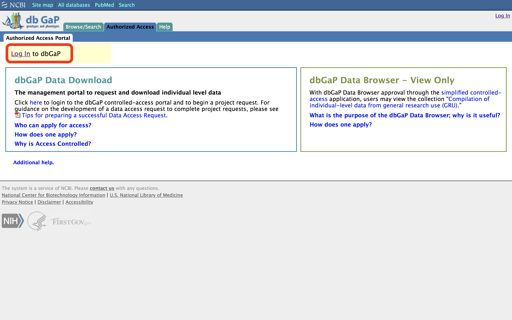
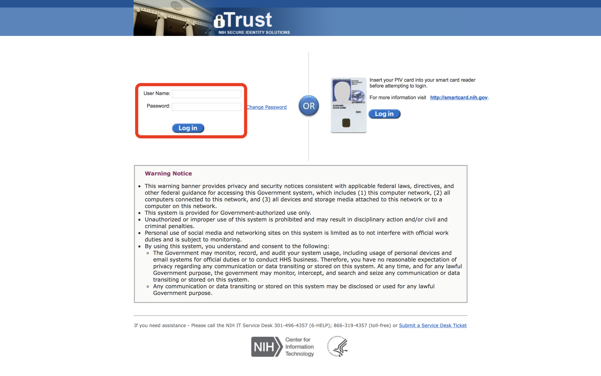
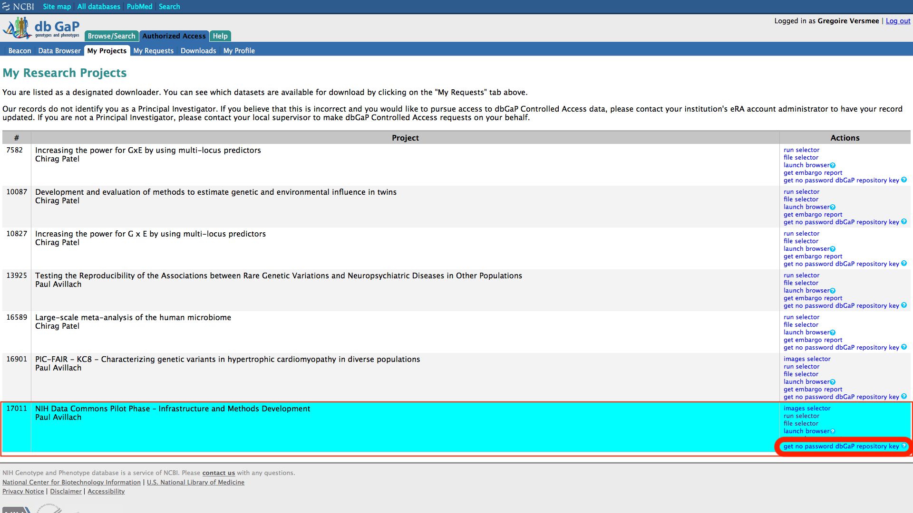
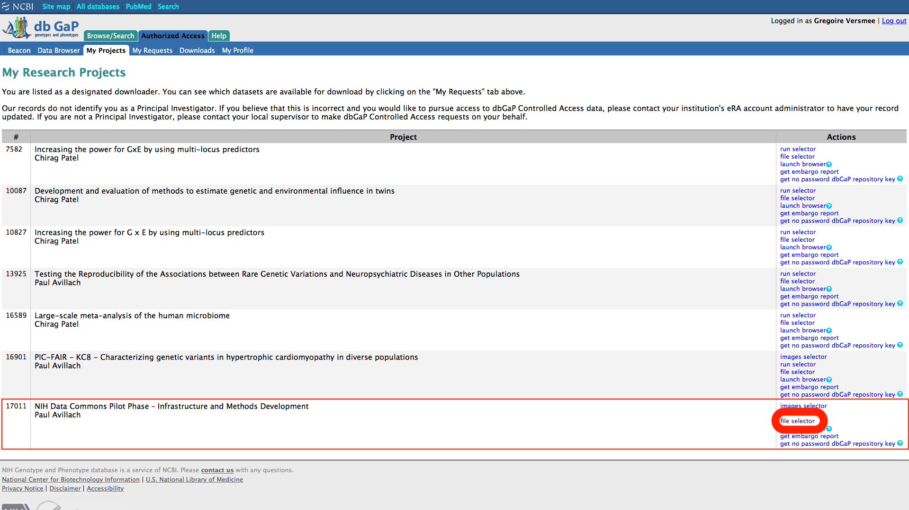
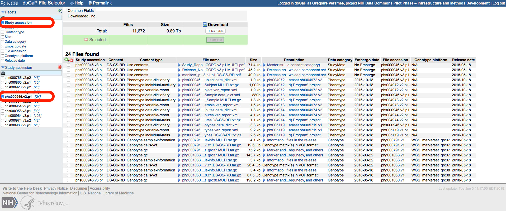
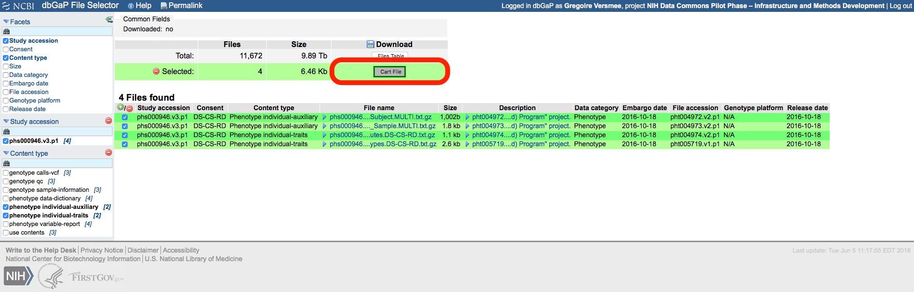

[](http://35.229.102.164/v2/gh/gversmee/dbGaP2x/master?filepath=dbGaP2x%2FdbGaP2x.ipynb)
[](https://opensource.org/licenses/Apache-2.0)
[](https://zenodo.org/badge/latestdoi/153461909)
[](https://hub.docker.com/r/gversmee/dbgap2x/)

# Using dbGaP2x, R package to explore, download and decrypt phenotypics and genomics data from dbGaP

You can test this software:
- Using binder, by clicking the "launch binder" badge above.
- Using the dockerized version on your local device by running


```bash
docker run -p 80:8888 -v /var/run/docker.sock:/var/run/docker.sock -u root gversmee/dbgap2x
```

and then open your web browser at http://localhost, and use the password `versmee`
- Using your local R by installing the package with


```R
devtools::install_github("gversmee/dbGaP2x")
```

## Introduction
### Load the package


```R
#devtools::install_github("gversmee/dbGaP2x", force = TRUE)
library(dbGaP2x)
```

### Get the list of the function for this new package


```R
lsf.str("package:dbGaP2x")
```


    browse.dbgap : function (phs, jupyter = FALSE)  
    browse.study : function (phs, jupyter = FALSE)  
    consent.groups : function (phs)  
    datatables.dict : function (phs)  
    dbgap.data_dict : function (xml, dest)  
    dbgap.decrypt : function (files, key = FALSE)  
    dbgap.download : function (krt, key = FALSE)  
    is.parent : function (phs)  
    n.pop : function (phs, consentgroups = TRUE, gender = TRUE)  
    n.tables : function (phs)  
    n.variables : function (phs)  
    parent.study : function (phs)  
    phs.version : function (phs)  
    search.dbgap : function (term, jupyter = FALSE)  
    study.name : function (phs)  
    sub.study : function (phs)  
    variables.dict : function (phs)  
    variables.report : function (phs)  


## 1. Search for dbGap studies
### Let's try to explore the "Jackson Heart Study" cohort that exists on dbGap.
###### We created the function "browse.dbgap", who helps you find the studies related to the term that you search on your web browser.
Note that if you run this function in a jupyterhub environment, it will return a url since jupyterhub doesn't have access to your local browser.


```R
search.dbgap("Jackson", jupyter = TRUE)
```


'https://www.ncbi.nlm.nih.gov/gap/?term=Jackson%5BStudy+Name%5D'


##### dbGap returns the list of the studies related to your term. As you see, there are 6 studies associated with the "Jackson Heart Study" (JHS). One of these study is the main one a.k.a the "parent study", whereas the other ones are substudies. In this case, phs000286.v5.p1 is the parent study. Firslty, we can use the phs.version() function in order to be sure that this is the latest version of the study. We can abbreviate the phs name by giving just the digit, or we can use the full dbGap id.


```R
phs.version("286")
```


'phs000286.v5.p1'


##### The is.parent() function is usefull to test if a study is a parent study or a substudy


```R
is.parent("000286") # JHS main cohort
is.parent("phs499") # substudy "CARe" for JHS
```


TRUE


FALSE


#### If you don't know the parent study of a substudy, try parent.study()


```R
parent.study("phs000499")
```


<ol class=list-inline>
	<li>'phs000286.v5.p1'</li>
	<li>'Jackson Heart Study (JHS) Cohort'</li>
</ol>


##### On the other side, use sub.study() to get the name and IDs of the substudies from a parent one


```R
sub.study("286")
```


<table>
<thead><tr><th scope=col>phs</th><th scope=col>name</th></tr></thead>
<tbody>
	<tr><td>phs000499.v3.p1                                                     </td><td>NHLBI Jackson Heart Study Candidate Gene Association Resource (CARe)</td></tr>
	<tr><td>phs000498.v3.p1                                                     </td><td>Jackson Heart Study Allelic Spectrum Project                        </td></tr>
	<tr><td>phs000402.v3.p1                                                     </td><td>NHLBI GO-ESP: Heart Cohorts Exome Sequencing Project (JHS)          </td></tr>
	<tr><td>phs001098.v1.p1                                                     </td><td>T2D-GENES Multi-Ethnic Exome Sequencing Study: Jackson Heart Study  </td></tr>
</tbody>
</table>


##### If you want to get the name of a study from its dbGap id, use study.name()


```R
study.name("286")
```


'Jackson Heart Study (JHS) Cohort'


##### Finally, you can watch your study on dbGap with browse.dbgap().
##### If a website exists for this study, you can browse it using browse.study()


```R
browse.dbgap("286", jupyter = TRUE)
browse.study("286", jupyter = TRUE)
```


'https://www.ncbi.nlm.nih.gov/projects/gap/cgi-bin/study.cgi?study_id=phs000286.v5.p1'


'https://www.jacksonheartstudy.org'


## 2. Explore the characteristics of your study
##### For each dbGap study, there can be multiple consent groups that will have there specificities. Use consent.groups to know the number and the name of the consent groups in the study that you are exploring. Let's keep focusing on JHS.


```R
JHS <- "phs000286"
consent.groups(JHS)
```


<table>
<thead><tr><th></th><th scope=col>shortName</th><th scope=col>longName</th></tr></thead>
<tbody>
	<tr><th scope=row>0</th><td>NRUP                                                                                                                                                                             </td><td>Subjects did not participate in the study, did not complete a consent document and are included only for the pedigree structure and/or genotype controls, such as HapMap subjects</td></tr>
	<tr><th scope=row>1</th><td>HMB-IRB-NPU                                                                                                                                                                      </td><td>Health/Medical/Biomedical (IRB, NPU)                                                                                                                                             </td></tr>
	<tr><th scope=row>2</th><td>DS-FDO-IRB-NPU                                                                                                                                                                   </td><td>Disease-Specific (Focused Disease Only, IRB, NPU)                                                                                                                                </td></tr>
	<tr><th scope=row>3</th><td>HMB-IRB                                                                                                                                                                          </td><td>Health/Medical/Biomedical (IRB)                                                                                                                                                  </td></tr>
	<tr><th scope=row>4</th><td>DS-FDO-IRB                                                                                                                                                                       </td><td>Disease-Specific (Focused Disease Only, IRB)                                                                                                                                     </td></tr>
</tbody>
</table>


##### Use n.pop() to know the number of patient included in each groups


```R
n.pop(JHS)
n.pop(JHS, consentgroups = FALSE)
```


<table>
<thead><tr><th scope=col>consent_group</th><th scope=col>male</th><th scope=col>female</th><th scope=col>total</th></tr></thead>
<tbody>
	<tr><td>HMB-IRB       </td><td>1860          </td><td>2504          </td><td>4549          </td></tr>
	<tr><td>HMB-IRB-NPU   </td><td> 264          </td><td> 505          </td><td> 802          </td></tr>
	<tr><td>DS-FDO-IRB-NPU</td><td>  63          </td><td> 107          </td><td> 180          </td></tr>
	<tr><td>HMB-IRB       </td><td> 784          </td><td>1232          </td><td>2131          </td></tr>
	<tr><td>DS-FDO-IRB    </td><td> 173          </td><td> 289          </td><td> 489          </td></tr>
	<tr><td>TOTAL         </td><td>3144          </td><td>4637          </td><td>8151          </td></tr>
</tbody>
</table>


8151


##### Use n.tables() and n.variables() to get the number of datatables in your study and the total number of variables
(n.variables goes into the study files to count the actual number of variables)


```R
n.tables(JHS)
n.variables(JHS)
```


66


4326


##### datatables.dict() will return a data frame with the datatables IDs (phtxxxxxx) and description of your study


```R
tablesdict <- datatables.dict(JHS)
head(tablesdict)
```


<table>
<thead><tr><th scope=col>pht</th><th scope=col>dt_study_name</th><th scope=col>dt_label</th></tr></thead>
<tbody>
	<tr><td>pht002539.v2                                                                                                                                                                                                                                                                                                                                                                                                                                                                                                                                                                                                                                                                                                                                                                                                                                                                                                                                                                                 </td><td>ESP_HeartGO_JHS_Subject_Phenotypes                                                                                                                                                                                                                                                                                                                                                                                                                                                                                                                                                                                                                                                                                                                                                                                                                                                                                                                                                           </td><td>Subject ID, ESP cohort, target capture used in sequencing, sequence center, race, sex, affection status, family medical history of stroke, participant medical history of asthma and COPD, ankle brachial index, artery disease status, atrioventricular block, blood pressure, body weight, height and BMI, coronary artery calcium, EKG, Framingham Risk Score, intimal-medial thickness, laboratory tests including basophils, eosinophils, neutrophils, lymphocytes, lymphocytes, blood fasting insulin and glucose, level of C-reactive protein, LDL, HDL, triglycerides, uric acid, urinary creatinine, serum creatinine, menopause, MI, FEV1, FVC, stroke status, type 2 diabetes, Wolff-Parkinson-White pattern, hormone replacement therapy, and smoking status of subjects participated in the "National Heart Lung and Blood Institute (NHLBI) GO-ESP: Heart Cohorts Component of the Exome Sequencing Project (JHS)" sub study of the "Jackson Heart Study (JHS) Cohort" project.</td></tr>
	<tr><td>pht001948.v1                                                                                                                                                                                                                                                                                                                                                                                                                                                                                                                                                                                                                                                                                                                                                                                                                                                                                                                                                                                 </td><td>CSTA                                                                                                                                                                                                                                                                                                                                                                                                                                                                                                                                                                                                                                                                                                                                                                                                                                                                                                                                                                                         </td><td>Agatston score of all coronary section among participants of the Jackson Heart Study including adult 35-84 years old African Americans.                                                                                                                                                                                                                                                                                                                                                                                                                                                                                                                                                                                                                                                                                                                                                                                                                                                      </td></tr>
	<tr><td>pht001947.v1                                                                                                                                                                                                                                                                                                                                                                                                                                                                                                                                                                                                                                                                                                                                                                                                                                                                                                                                                                                 </td><td>CSIA                                                                                                                                                                                                                                                                                                                                                                                                                                                                                                                                                                                                                                                                                                                                                                                                                                                                                                                                                                                         </td><td>Approach to life B. Life style among participants of the Jackson Heart Study including adult 35-84 years old African Americans.                                                                                                                                                                                                                                                                                                                                                                                                                                                                                                                                                                                                                                                                                                                                                                                                                                                              </td></tr>
	<tr><td>pht001968.v1                                                                                                                                                                                                                                                                                                                                                                                                                                                                                                                                                                                                                                                                                                                                                                                                                                                                                                                                                                                 </td><td>PPAA                                                                                                                                                                                                                                                                                                                                                                                                                                                                                                                                                                                                                                                                                                                                                                                                                                                                                                                                                                                         </td><td>Post physical activity monitoring among participants of the Jackson Heart Study including adult 35-84 years old African Americans.                                                                                                                                                                                                                                                                                                                                                                                                                                                                                                                                                                                                                                                                                                                                                                                                                                                           </td></tr>
	<tr><td>pht001955.v1                                                                                                                                                                                                                                                                                                                                                                                                                                                                                                                                                                                                                                                                                                                                                                                                                                                                                                                                                                                 </td><td>ECHA                                                                                                                                                                                                                                                                                                                                                                                                                                                                                                                                                                                                                                                                                                                                                                                                                                                                                                                                                                                         </td><td>Echocardiographic abnormalities among participants of the Jackson Heart Study including adult 35-84 years old African Americans.                                                                                                                                                                                                                                                                                                                                                                                                                                                                                                                                                                                                                                                                                                                                                                                                                                                             </td></tr>
	<tr><td>pht001952.v1                                                                                                                                                                                                                                                                                                                                                                                                                                                                                                                                                                                                                                                                                                                                                                                                                                                                                                                                                                                 </td><td>DPASS_DIET1                                                                                                                                                                                                                                                                                                                                                                                                                                                                                                                                                                                                                                                                                                                                                                                                                                                                                                                                                                                  </td><td>Dietary data (DPASS) among participants of the Jackson Heart Study including adult 35-84 years old African Americans.                                                                                                                                                                                                                                                                                                                                                                                                                                                                                                                                                                                                                                                                                                                                                                                                                                                                        </td></tr>
</tbody>
</table>


##### variables.dict() will return a data frame with the variables IDs (phvxxxxxx), their name in the study, the datatable where they come from and their description


```R
vardict <- variables.dict(JHS)
head(vardict)
```


<table>
<thead><tr><th scope=col>dt_study_name</th><th scope=col>phv</th><th scope=col>var_name</th><th scope=col>var_desc</th></tr></thead>
<tbody>
	<tr><td>ESP_HeartGO_JHS_Subject_Phenotypes                                                                                                                                                                                                            </td><td>phv00165323.v2                                                                                                                                                                                                                                </td><td>SUBJID                                                                                                                                                                                                                                        </td><td>Subject ID                                                                                                                                                                                                                                    </td></tr>
	<tr><td>ESP_HeartGO_JHS_Subject_Phenotypes                                                                                                                                                                                                            </td><td>phv00165322.v2                                                                                                                                                                                                                                </td><td>ESP_Cohort                                                                                                                                                                                                                                    </td><td>Cohort name [JHS]                                                                                                                                                                                                                             </td></tr>
	<tr><td>ESP_HeartGO_JHS_Subject_Phenotypes                                                                                                                                                                                                            </td><td>phv00165324.v2                                                                                                                                                                                                                                </td><td>ESP_phenotype                                                                                                                                                                                                                                 </td><td>ESP Phenotype group (phenotype that the sample was selected to be sequenced for) [EOMI_Control (Early MI control), LDL_Low, LDL_High, BP_Low (low blood pressure); BP_High (high blood pressure); DPR (Deeply Phenotyped Reference); BMI_High]</td></tr>
	<tr><td>ESP_HeartGO_JHS_Subject_Phenotypes                                                                                                                                                                                                            </td><td>phv00181282.v1                                                                                                                                                                                                                                </td><td>Sequence_center                                                                                                                                                                                                                               </td><td>Indicates where the sample was sequence at [Broad, UW]                                                                                                                                                                                        </td></tr>
	<tr><td>ESP_HeartGO_JHS_Subject_Phenotypes                                                                                                                                                                                                            </td><td>phv00181283.v1                                                                                                                                                                                                                                </td><td>Target                                                                                                                                                                                                                                        </td><td>Indicates target capture used in sequencing                                                                                                                                                                                                   </td></tr>
	<tr><td>ESP_HeartGO_JHS_Subject_Phenotypes                                                                                                                                                                                                            </td><td>phv00181284.v1                                                                                                                                                                                                                                </td><td>ESP_race_selfreport                                                                                                                                                                                                                           </td><td>Self report race [African American]                                                                                                                                                                                                           </td></tr>
</tbody>
</table>


##### variables.report() will return an html table with the summary statistics of the numerical variables available in the study


```R
table1 <- variables.report("286")
IRdisplay::display_html(table1)
```


<table class='gmisc_table' style='border-collapse: collapse; margin-top: 1em; margin-bottom: 1em;' >
<thead>
<tr><td colspan='23' style='text-align: left;'>
Table 1a: Summary statistics of numerical variables from Jackson Heart Study (JHS) Cohort broken down by consent group.</td></tr>
<tr>
<th style='border-top: 2px solid grey;'></th>
<th colspan='2' style='font-weight: 900; border-top: 2px solid grey; text-align: center;'></th><th style='border-top: 2px solid grey;; border-bottom: hidden;'>&nbsp;</th>
<th colspan='3' style='font-weight: 900; border-bottom: 1px solid grey; border-top: 2px solid grey; text-align: center;'>total</th><th style='border-top: 2px solid grey;; border-bottom: hidden;'>&nbsp;</th>
<th colspan='3' style='font-weight: 900; border-bottom: 1px solid grey; border-top: 2px solid grey; text-align: center;'>HMB-IRB-NPU</th><th style='border-top: 2px solid grey;; border-bottom: hidden;'>&nbsp;</th>
<th colspan='3' style='font-weight: 900; border-bottom: 1px solid grey; border-top: 2px solid grey; text-align: center;'>DS-FDO-IRB-NPU</th><th style='border-top: 2px solid grey;; border-bottom: hidden;'>&nbsp;</th>
<th colspan='3' style='font-weight: 900; border-bottom: 1px solid grey; border-top: 2px solid grey; text-align: center;'>HMB-IRB</th><th style='border-top: 2px solid grey;; border-bottom: hidden;'>&nbsp;</th>
<th colspan='3' style='font-weight: 900; border-bottom: 1px solid grey; border-top: 2px solid grey; text-align: center;'>DS-FDO-IRB</th>
</tr>
<tr>
<th style='border-bottom: 1px solid grey;'> </th>
<th style='border-bottom: 1px solid grey; text-align: center;'>id</th>
<th style='border-bottom: 1px solid grey; text-align: center;'>description</th>
<th style='border-bottom: 1px solid grey;' colspan='1'>&nbsp;</th>
<th style='border-bottom: 1px solid grey; text-align: center;'>n</th>
<th style='border-bottom: 1px solid grey; text-align: center;'>mean</th>
<th style='border-bottom: 1px solid grey; text-align: center;'>sd</th>
<th style='border-bottom: 1px solid grey;' colspan='1'>&nbsp;</th>
<th style='border-bottom: 1px solid grey; text-align: center;'>n</th>
<th style='border-bottom: 1px solid grey; text-align: center;'>mean</th>
<th style='border-bottom: 1px solid grey; text-align: center;'>sd</th>
<th style='border-bottom: 1px solid grey;' colspan='1'>&nbsp;</th>
<th style='border-bottom: 1px solid grey; text-align: center;'>n</th>
<th style='border-bottom: 1px solid grey; text-align: center;'>mean</th>
<th style='border-bottom: 1px solid grey; text-align: center;'>sd</th>
<th style='border-bottom: 1px solid grey;' colspan='1'>&nbsp;</th>
<th style='border-bottom: 1px solid grey; text-align: center;'>n</th>
<th style='border-bottom: 1px solid grey; text-align: center;'>mean</th>
<th style='border-bottom: 1px solid grey; text-align: center;'>sd</th>
<th style='border-bottom: 1px solid grey;' colspan='1'>&nbsp;</th>
<th style='border-bottom: 1px solid grey; text-align: center;'>n</th>
<th style='border-bottom: 1px solid grey; text-align: center;'>mean</th>
<th style='border-bottom: 1px solid grey; text-align: center;'>sd</th>
</tr>
</thead>
<tbody>
<tr>
<td style='text-align: left;'>1</td>
<td style='text-align: center;'>phv00165330.v2.p1</td>
<td style='text-align: center;'>Age in years at baseline</td>
<td style='' colspan='1'>&nbsp;</td>
<td style='text-align: center; background-color: #e6e6f0;'>402</td>
<td style='text-align: center; background-color: #e6e6f0;'>54.58</td>
<td style='text-align: center; background-color: #e6e6f0;'>12.87</td>
<td style='' colspan='1'>&nbsp;</td>
<td style='text-align: center;'>62</td>
<td style='text-align: center;'>55.29</td>
<td style='text-align: center;'>13.34</td>
<td style='' colspan='1'>&nbsp;</td>
<td style='text-align: center;'>22</td>
<td style='text-align: center;'>53.09</td>
<td style='text-align: center;'>15.12</td>
<td style='' colspan='1'>&nbsp;</td>
<td style='text-align: center;'>268</td>
<td style='text-align: center;'>54.66</td>
<td style='text-align: center;'>12.83</td>
<td style='' colspan='1'>&nbsp;</td>
<td style='text-align: center;'>50</td>
<td style='text-align: center;'>53.92</td>
<td style='text-align: center;'>11.71</td>
</tr>
<tr>
<td style='text-align: left;'>2</td>
<td style='text-align: center;'>phv00165334.v2.p1</td>
<td style='text-align: center;'>Framingham Risk Score predicted prob. calculated at baseline (was not calculated for those with baseline history of MI)</td>
<td style='' colspan='1'>&nbsp;</td>
<td style='text-align: center; background-color: #e6e6f0;'>358</td>
<td style='text-align: center; background-color: #e6e6f0;'>13.69</td>
<td style='text-align: center; background-color: #e6e6f0;'>11.39</td>
<td style='' colspan='1'>&nbsp;</td>
<td style='text-align: center;'>51</td>
<td style='text-align: center;'>12.1</td>
<td style='text-align: center;'>10.36</td>
<td style='' colspan='1'>&nbsp;</td>
<td style='text-align: center;'>20</td>
<td style='text-align: center;'>10.6</td>
<td style='text-align: center;'>8.647</td>
<td style='' colspan='1'>&nbsp;</td>
<td style='text-align: center;'>242</td>
<td style='text-align: center;'>13.66</td>
<td style='text-align: center;'>10.83</td>
<td style='' colspan='1'>&nbsp;</td>
<td style='text-align: center;'>45</td>
<td style='text-align: center;'>17.02</td>
<td style='text-align: center;'>15.45</td>
</tr>
<tr>
<td style='text-align: left;'>3</td>
<td style='text-align: center;'>phv00165335.v2.p1</td>
<td style='text-align: center;'>Baseline BMI in kg/m2</td>
<td style='' colspan='1'>&nbsp;</td>
<td style='text-align: center; background-color: #e6e6f0;'>402</td>
<td style='text-align: center; background-color: #e6e6f0;'>36.74</td>
<td style='text-align: center; background-color: #e6e6f0;'>11.49</td>
<td style='' colspan='1'>&nbsp;</td>
<td style='text-align: center;'>62</td>
<td style='text-align: center;'>37.36</td>
<td style='text-align: center;'>11.72</td>
<td style='' colspan='1'>&nbsp;</td>
<td style='text-align: center;'>22</td>
<td style='text-align: center;'>35.78</td>
<td style='text-align: center;'>11.14</td>
<td style='' colspan='1'>&nbsp;</td>
<td style='text-align: center;'>268</td>
<td style='text-align: center;'>36.33</td>
<td style='text-align: center;'>11.38</td>
<td style='' colspan='1'>&nbsp;</td>
<td style='text-align: center;'>50</td>
<td style='text-align: center;'>38.62</td>
<td style='text-align: center;'>12.01</td>
</tr>
<tr>
<td style='text-align: left;'>4</td>
<td style='text-align: center;'>phv00165337.v2.p1</td>
<td style='text-align: center;'>Weight in kilograms at baseline</td>
<td style='' colspan='1'>&nbsp;</td>
<td style='text-align: center; background-color: #e6e6f0;'>402</td>
<td style='text-align: center; background-color: #e6e6f0;'>104.6</td>
<td style='text-align: center; background-color: #e6e6f0;'>28.87</td>
<td style='' colspan='1'>&nbsp;</td>
<td style='text-align: center;'>62</td>
<td style='text-align: center;'>106.2</td>
<td style='text-align: center;'>29.04</td>
<td style='' colspan='1'>&nbsp;</td>
<td style='text-align: center;'>22</td>
<td style='text-align: center;'>103</td>
<td style='text-align: center;'>30.31</td>
<td style='' colspan='1'>&nbsp;</td>
<td style='text-align: center;'>268</td>
<td style='text-align: center;'>103.6</td>
<td style='text-align: center;'>28.58</td>
<td style='' colspan='1'>&nbsp;</td>
<td style='text-align: center;'>50</td>
<td style='text-align: center;'>108.3</td>
<td style='text-align: center;'>30.03</td>
</tr>
<tr>
<td style='text-align: left;'>5</td>
<td style='text-align: center;'>phv00165338.v2.p1</td>
<td style='text-align: center;'>Waist in centimeters at baseline</td>
<td style='' colspan='1'>&nbsp;</td>
<td style='text-align: center; background-color: #e6e6f0;'>402</td>
<td style='text-align: center; background-color: #e6e6f0;'>109.9</td>
<td style='text-align: center; background-color: #e6e6f0;'>20.32</td>
<td style='' colspan='1'>&nbsp;</td>
<td style='text-align: center;'>62</td>
<td style='text-align: center;'>111.5</td>
<td style='text-align: center;'>20.3</td>
<td style='' colspan='1'>&nbsp;</td>
<td style='text-align: center;'>22</td>
<td style='text-align: center;'>104.5</td>
<td style='text-align: center;'>22.92</td>
<td style='' colspan='1'>&nbsp;</td>
<td style='text-align: center;'>268</td>
<td style='text-align: center;'>109</td>
<td style='text-align: center;'>19.72</td>
<td style='' colspan='1'>&nbsp;</td>
<td style='text-align: center;'>50</td>
<td style='text-align: center;'>115.1</td>
<td style='text-align: center;'>21.8</td>
</tr>
<tr>
<td style='text-align: left;'>6</td>
<td style='text-align: center;'>phv00165340.v2.p1</td>
<td style='text-align: center;'>Standing height in centimeters at baseline</td>
<td style='' colspan='1'>&nbsp;</td>
<td style='text-align: center; background-color: #e6e6f0;'>402</td>
<td style='text-align: center; background-color: #e6e6f0;'>169.7</td>
<td style='text-align: center; background-color: #e6e6f0;'>9.445</td>
<td style='' colspan='1'>&nbsp;</td>
<td style='text-align: center;'>62</td>
<td style='text-align: center;'>169.6</td>
<td style='text-align: center;'>8.485</td>
<td style='' colspan='1'>&nbsp;</td>
<td style='text-align: center;'>22</td>
<td style='text-align: center;'>170.5</td>
<td style='text-align: center;'>9.46</td>
<td style='' colspan='1'>&nbsp;</td>
<td style='text-align: center;'>268</td>
<td style='text-align: center;'>169.9</td>
<td style='text-align: center;'>9.808</td>
<td style='' colspan='1'>&nbsp;</td>
<td style='text-align: center;'>50</td>
<td style='text-align: center;'>168.5</td>
<td style='text-align: center;'>8.704</td>
</tr>
<tr>
<td style='text-align: left;'>7</td>
<td style='text-align: center;'>phv00165341.v2.p1</td>
<td style='text-align: center;'>Baseline calculated LDL in mg/dL (missing where trigs>400)</td>
<td style='' colspan='1'>&nbsp;</td>
<td style='text-align: center; background-color: #e6e6f0;'>380</td>
<td style='text-align: center; background-color: #e6e6f0;'>131.1</td>
<td style='text-align: center; background-color: #e6e6f0;'>50.71</td>
<td style='' colspan='1'>&nbsp;</td>
<td style='text-align: center;'>61</td>
<td style='text-align: center;'>127.2</td>
<td style='text-align: center;'>53.48</td>
<td style='' colspan='1'>&nbsp;</td>
<td style='text-align: center;'>21</td>
<td style='text-align: center;'>109.5</td>
<td style='text-align: center;'>45.72</td>
<td style='' colspan='1'>&nbsp;</td>
<td style='text-align: center;'>253</td>
<td style='text-align: center;'>133.2</td>
<td style='text-align: center;'>48.84</td>
<td style='' colspan='1'>&nbsp;</td>
<td style='text-align: center;'>45</td>
<td style='text-align: center;'>134.7</td>
<td style='text-align: center;'>57.94</td>
</tr>
<tr>
<td style='text-align: left;'>8</td>
<td style='text-align: center;'>phv00165342.v2.p1</td>
<td style='text-align: center;'>HDL level in mg/dL at baseline</td>
<td style='' colspan='1'>&nbsp;</td>
<td style='text-align: center; background-color: #e6e6f0;'>388</td>
<td style='text-align: center; background-color: #e6e6f0;'>48.59</td>
<td style='text-align: center; background-color: #e6e6f0;'>15.16</td>
<td style='' colspan='1'>&nbsp;</td>
<td style='text-align: center;'>61</td>
<td style='text-align: center;'>50.7</td>
<td style='text-align: center;'>11.11</td>
<td style='' colspan='1'>&nbsp;</td>
<td style='text-align: center;'>21</td>
<td style='text-align: center;'>49.29</td>
<td style='text-align: center;'>14.15</td>
<td style='' colspan='1'>&nbsp;</td>
<td style='text-align: center;'>259</td>
<td style='text-align: center;'>48.49</td>
<td style='text-align: center;'>16.63</td>
<td style='' colspan='1'>&nbsp;</td>
<td style='text-align: center;'>47</td>
<td style='text-align: center;'>46.02</td>
<td style='text-align: center;'>11.01</td>
</tr>
<tr>
<td style='text-align: left;'>9</td>
<td style='text-align: center;'>phv00165343.v2.p1</td>
<td style='text-align: center;'>Triglycerides at baseline in mg/dL</td>
<td style='' colspan='1'>&nbsp;</td>
<td style='text-align: center; background-color: #e6e6f0;'>388</td>
<td style='text-align: center; background-color: #e6e6f0;'>122.1</td>
<td style='text-align: center; background-color: #e6e6f0;'>87.5</td>
<td style='' colspan='1'>&nbsp;</td>
<td style='text-align: center;'>61</td>
<td style='text-align: center;'>115.4</td>
<td style='text-align: center;'>67.97</td>
<td style='' colspan='1'>&nbsp;</td>
<td style='text-align: center;'>21</td>
<td style='text-align: center;'>113.8</td>
<td style='text-align: center;'>78.09</td>
<td style='' colspan='1'>&nbsp;</td>
<td style='text-align: center;'>259</td>
<td style='text-align: center;'>121.1</td>
<td style='text-align: center;'>84.63</td>
<td style='' colspan='1'>&nbsp;</td>
<td style='text-align: center;'>47</td>
<td style='text-align: center;'>140.4</td>
<td style='text-align: center;'>123</td>
</tr>
<tr>
<td style='text-align: left;'>10</td>
<td style='text-align: center;'>phv00165344.v2.p1</td>
<td style='text-align: center;'>Total cholesterol at baseline in mg/dL</td>
<td style='' colspan='1'>&nbsp;</td>
<td style='text-align: center; background-color: #e6e6f0;'>388</td>
<td style='text-align: center; background-color: #e6e6f0;'>203.5</td>
<td style='text-align: center; background-color: #e6e6f0;'>52.78</td>
<td style='' colspan='1'>&nbsp;</td>
<td style='text-align: center;'>61</td>
<td style='text-align: center;'>201</td>
<td style='text-align: center;'>54.64</td>
<td style='' colspan='1'>&nbsp;</td>
<td style='text-align: center;'>21</td>
<td style='text-align: center;'>181.6</td>
<td style='text-align: center;'>42.44</td>
<td style='' colspan='1'>&nbsp;</td>
<td style='text-align: center;'>259</td>
<td style='text-align: center;'>205.1</td>
<td style='text-align: center;'>51.96</td>
<td style='' colspan='1'>&nbsp;</td>
<td style='text-align: center;'>47</td>
<td style='text-align: center;'>207.4</td>
<td style='text-align: center;'>57.93</td>
</tr>
<tr>
<td style='text-align: left;'>11</td>
<td style='text-align: center;'>phv00165346.v2.p1</td>
<td style='text-align: center;'>Systolic blood pressure at baseline (avg. of 2 measurements), in mm Hg</td>
<td style='' colspan='1'>&nbsp;</td>
<td style='text-align: center; background-color: #e6e6f0;'>402</td>
<td style='text-align: center; background-color: #e6e6f0;'>129.4</td>
<td style='text-align: center; background-color: #e6e6f0;'>20.61</td>
<td style='' colspan='1'>&nbsp;</td>
<td style='text-align: center;'>62</td>
<td style='text-align: center;'>128.8</td>
<td style='text-align: center;'>19.59</td>
<td style='' colspan='1'>&nbsp;</td>
<td style='text-align: center;'>22</td>
<td style='text-align: center;'>123.9</td>
<td style='text-align: center;'>18.51</td>
<td style='' colspan='1'>&nbsp;</td>
<td style='text-align: center;'>268</td>
<td style='text-align: center;'>130.1</td>
<td style='text-align: center;'>21.42</td>
<td style='' colspan='1'>&nbsp;</td>
<td style='text-align: center;'>50</td>
<td style='text-align: center;'>128.5</td>
<td style='text-align: center;'>18.29</td>
</tr>
<tr>
<td style='text-align: left;'>12</td>
<td style='text-align: center;'>phv00165347.v2.p1</td>
<td style='text-align: center;'>Diastolic blood pressure at baseline (avg. of 2 measurements), in mm Hg</td>
<td style='' colspan='1'>&nbsp;</td>
<td style='text-align: center; background-color: #e6e6f0;'>402</td>
<td style='text-align: center; background-color: #e6e6f0;'>80.33</td>
<td style='text-align: center; background-color: #e6e6f0;'>12.29</td>
<td style='' colspan='1'>&nbsp;</td>
<td style='text-align: center;'>62</td>
<td style='text-align: center;'>77.94</td>
<td style='text-align: center;'>11.95</td>
<td style='' colspan='1'>&nbsp;</td>
<td style='text-align: center;'>22</td>
<td style='text-align: center;'>78.45</td>
<td style='text-align: center;'>9.017</td>
<td style='' colspan='1'>&nbsp;</td>
<td style='text-align: center;'>268</td>
<td style='text-align: center;'>81.11</td>
<td style='text-align: center;'>12.76</td>
<td style='' colspan='1'>&nbsp;</td>
<td style='text-align: center;'>50</td>
<td style='text-align: center;'>79.92</td>
<td style='text-align: center;'>11.09</td>
</tr>
<tr>
<td style='text-align: left;'>13</td>
<td style='text-align: center;'>phv00165357.v2.p1</td>
<td style='text-align: center;'>Age in years at menarche</td>
<td style='' colspan='1'>&nbsp;</td>
<td style='text-align: center; background-color: #e6e6f0;'>222</td>
<td style='text-align: center; background-color: #e6e6f0;'>12.64</td>
<td style='text-align: center; background-color: #e6e6f0;'>1.883</td>
<td style='' colspan='1'>&nbsp;</td>
<td style='text-align: center;'>36</td>
<td style='text-align: center;'>12.44</td>
<td style='text-align: center;'>1.731</td>
<td style='' colspan='1'>&nbsp;</td>
<td style='text-align: center;'>14</td>
<td style='text-align: center;'>13.5</td>
<td style='text-align: center;'>2.279</td>
<td style='' colspan='1'>&nbsp;</td>
<td style='text-align: center;'>141</td>
<td style='text-align: center;'>12.69</td>
<td style='text-align: center;'>1.964</td>
<td style='' colspan='1'>&nbsp;</td>
<td style='text-align: center;'>31</td>
<td style='text-align: center;'>12.23</td>
<td style='text-align: center;'>1.334</td>
</tr>
<tr>
<td style='text-align: left;'>14</td>
<td style='text-align: center;'>phv00165362.v2.p1</td>
<td style='text-align: center;'>Blood fasting glucose at baseline in mg/dL</td>
<td style='' colspan='1'>&nbsp;</td>
<td style='text-align: center; background-color: #e6e6f0;'>389</td>
<td style='text-align: center; background-color: #e6e6f0;'>22.02</td>
<td style='text-align: center; background-color: #e6e6f0;'>50.29</td>
<td style='' colspan='1'>&nbsp;</td>
<td style='text-align: center;'>61</td>
<td style='text-align: center;'>36.11</td>
<td style='text-align: center;'>123.5</td>
<td style='' colspan='1'>&nbsp;</td>
<td style='text-align: center;'>21</td>
<td style='text-align: center;'>14</td>
<td style='text-align: center;'>8.081</td>
<td style='' colspan='1'>&nbsp;</td>
<td style='text-align: center;'>260</td>
<td style='text-align: center;'>19.07</td>
<td style='text-align: center;'>12.72</td>
<td style='' colspan='1'>&nbsp;</td>
<td style='text-align: center;'>47</td>
<td style='text-align: center;'>23.66</td>
<td style='text-align: center;'>12.45</td>
</tr>
<tr>
<td style='text-align: left;'>15</td>
<td style='text-align: center;'>phv00165363.v2.p1</td>
<td style='text-align: center;'>Blood fasting insulin at baseline in uU/mL.  (Note that there are some extreme outliers)</td>
<td style='' colspan='1'>&nbsp;</td>
<td style='text-align: center; background-color: #e6e6f0;'>388</td>
<td style='text-align: center; background-color: #e6e6f0;'>106.4</td>
<td style='text-align: center; background-color: #e6e6f0;'>38.23</td>
<td style='' colspan='1'>&nbsp;</td>
<td style='text-align: center;'>61</td>
<td style='text-align: center;'>106.7</td>
<td style='text-align: center;'>37.49</td>
<td style='' colspan='1'>&nbsp;</td>
<td style='text-align: center;'>20</td>
<td style='text-align: center;'>99.05</td>
<td style='text-align: center;'>21.76</td>
<td style='' colspan='1'>&nbsp;</td>
<td style='text-align: center;'>260</td>
<td style='text-align: center;'>106.4</td>
<td style='text-align: center;'>38.48</td>
<td style='' colspan='1'>&nbsp;</td>
<td style='text-align: center;'>47</td>
<td style='text-align: center;'>109.2</td>
<td style='text-align: center;'>43.57</td>
</tr>
<tr>
<td style='text-align: left;'>16</td>
<td style='text-align: center;'>phv00165372.v2.p1</td>
<td style='text-align: center;'>C-reactive protein level in mg/L at designated visit (may not be baseline)</td>
<td style='' colspan='1'>&nbsp;</td>
<td style='text-align: center; background-color: #e6e6f0;'>402</td>
<td style='text-align: center; background-color: #e6e6f0;'>6.419</td>
<td style='text-align: center; background-color: #e6e6f0;'>8.622</td>
<td style='' colspan='1'>&nbsp;</td>
<td style='text-align: center;'>62</td>
<td style='text-align: center;'>7.534</td>
<td style='text-align: center;'>11.09</td>
<td style='' colspan='1'>&nbsp;</td>
<td style='text-align: center;'>22</td>
<td style='text-align: center;'>4.047</td>
<td style='text-align: center;'>5.362</td>
<td style='' colspan='1'>&nbsp;</td>
<td style='text-align: center;'>268</td>
<td style='text-align: center;'>6.033</td>
<td style='text-align: center;'>8.068</td>
<td style='' colspan='1'>&nbsp;</td>
<td style='text-align: center;'>50</td>
<td style='text-align: center;'>8.149</td>
<td style='text-align: center;'>8.962</td>
</tr>
<tr>
<td style='text-align: left;'>17</td>
<td style='text-align: center;'>phv00165373.v2.p1</td>
<td style='text-align: center;'>Age in years at CRP measurement</td>
<td style='' colspan='1'>&nbsp;</td>
<td style='text-align: center; background-color: #e6e6f0;'>402</td>
<td style='text-align: center; background-color: #e6e6f0;'>54.58</td>
<td style='text-align: center; background-color: #e6e6f0;'>12.87</td>
<td style='' colspan='1'>&nbsp;</td>
<td style='text-align: center;'>62</td>
<td style='text-align: center;'>55.29</td>
<td style='text-align: center;'>13.34</td>
<td style='' colspan='1'>&nbsp;</td>
<td style='text-align: center;'>22</td>
<td style='text-align: center;'>53.09</td>
<td style='text-align: center;'>15.12</td>
<td style='' colspan='1'>&nbsp;</td>
<td style='text-align: center;'>268</td>
<td style='text-align: center;'>54.66</td>
<td style='text-align: center;'>12.83</td>
<td style='' colspan='1'>&nbsp;</td>
<td style='text-align: center;'>50</td>
<td style='text-align: center;'>53.92</td>
<td style='text-align: center;'>11.71</td>
</tr>
<tr>
<td style='text-align: left;'>18</td>
<td style='text-align: center;'>phv00165380.v2.p1</td>
<td style='text-align: center;'>White blood count in x1,000/cubic mm at designated visit (may not be baseline)</td>
<td style='' colspan='1'>&nbsp;</td>
<td style='text-align: center; background-color: #e6e6f0;'>378</td>
<td style='text-align: center; background-color: #e6e6f0;'>5.774</td>
<td style='text-align: center; background-color: #e6e6f0;'>1.664</td>
<td style='' colspan='1'>&nbsp;</td>
<td style='text-align: center;'>50</td>
<td style='text-align: center;'>5.758</td>
<td style='text-align: center;'>1.743</td>
<td style='' colspan='1'>&nbsp;</td>
<td style='text-align: center;'>21</td>
<td style='text-align: center;'>5.914</td>
<td style='text-align: center;'>1.819</td>
<td style='' colspan='1'>&nbsp;</td>
<td style='text-align: center;'>259</td>
<td style='text-align: center;'>5.7</td>
<td style='text-align: center;'>1.606</td>
<td style='' colspan='1'>&nbsp;</td>
<td style='text-align: center;'>48</td>
<td style='text-align: center;'>6.129</td>
<td style='text-align: center;'>1.818</td>
</tr>
<tr>
<td style='text-align: left;'>19</td>
<td style='text-align: center;'>phv00165381.v2.p1</td>
<td style='text-align: center;'>Age in years at WBC measurement</td>
<td style='' colspan='1'>&nbsp;</td>
<td style='text-align: center; background-color: #e6e6f0;'>378</td>
<td style='text-align: center; background-color: #e6e6f0;'>54.38</td>
<td style='text-align: center; background-color: #e6e6f0;'>12.96</td>
<td style='' colspan='1'>&nbsp;</td>
<td style='text-align: center;'>50</td>
<td style='text-align: center;'>54.16</td>
<td style='text-align: center;'>13.6</td>
<td style='' colspan='1'>&nbsp;</td>
<td style='text-align: center;'>21</td>
<td style='text-align: center;'>53.38</td>
<td style='text-align: center;'>15.43</td>
<td style='' colspan='1'>&nbsp;</td>
<td style='text-align: center;'>259</td>
<td style='text-align: center;'>54.67</td>
<td style='text-align: center;'>12.9</td>
<td style='' colspan='1'>&nbsp;</td>
<td style='text-align: center;'>48</td>
<td style='text-align: center;'>53.5</td>
<td style='text-align: center;'>11.75</td>
</tr>
<tr>
<td style='text-align: left;'>20</td>
<td style='text-align: center;'>phv00165382.v2.p1</td>
<td style='text-align: center;'>Hemoglobin at designated visit (may not be baseline) in g/dl</td>
<td style='' colspan='1'>&nbsp;</td>
<td style='text-align: center; background-color: #e6e6f0;'>396</td>
<td style='text-align: center; background-color: #e6e6f0;'>13.02</td>
<td style='text-align: center; background-color: #e6e6f0;'>1.604</td>
<td style='' colspan='1'>&nbsp;</td>
<td style='text-align: center;'>58</td>
<td style='text-align: center;'>12.61</td>
<td style='text-align: center;'>2.099</td>
<td style='' colspan='1'>&nbsp;</td>
<td style='text-align: center;'>21</td>
<td style='text-align: center;'>13.09</td>
<td style='text-align: center;'>1.368</td>
<td style='' colspan='1'>&nbsp;</td>
<td style='text-align: center;'>268</td>
<td style='text-align: center;'>13.14</td>
<td style='text-align: center;'>1.481</td>
<td style='' colspan='1'>&nbsp;</td>
<td style='text-align: center;'>49</td>
<td style='text-align: center;'>12.78</td>
<td style='text-align: center;'>1.619</td>
</tr>
<tr>
<td style='text-align: left;'>21</td>
<td style='text-align: center;'>phv00165383.v2.p1</td>
<td style='text-align: center;'>Age in years at hemoglobin measurement</td>
<td style='' colspan='1'>&nbsp;</td>
<td style='text-align: center; background-color: #e6e6f0;'>396</td>
<td style='text-align: center; background-color: #e6e6f0;'>54.5</td>
<td style='text-align: center; background-color: #e6e6f0;'>12.92</td>
<td style='' colspan='1'>&nbsp;</td>
<td style='text-align: center;'>58</td>
<td style='text-align: center;'>54.91</td>
<td style='text-align: center;'>13.64</td>
<td style='' colspan='1'>&nbsp;</td>
<td style='text-align: center;'>21</td>
<td style='text-align: center;'>53.38</td>
<td style='text-align: center;'>15.43</td>
<td style='' colspan='1'>&nbsp;</td>
<td style='text-align: center;'>268</td>
<td style='text-align: center;'>54.66</td>
<td style='text-align: center;'>12.83</td>
<td style='' colspan='1'>&nbsp;</td>
<td style='text-align: center;'>49</td>
<td style='text-align: center;'>53.65</td>
<td style='text-align: center;'>11.68</td>
</tr>
...
<tr>
<td style='text-align: left;'>2140</td>
<td style='text-align: center;'>phv00265465.v1.p1</td>
<td style='text-align: center;'>HbA1C</td>
<td style='' colspan='1'>&nbsp;</td>
<td style='text-align: center; background-color: #e6e6f0;'>992</td>
<td style='text-align: center; background-color: #e6e6f0;'>6.42</td>
<td style='text-align: center; background-color: #e6e6f0;'>1.757</td>
<td style='' colspan='1'>&nbsp;</td>
<td style='text-align: center;'>258</td>
<td style='text-align: center;'>6.429</td>
<td style='text-align: center;'>1.76</td>
<td style='' colspan='1'>&nbsp;</td>
<td style='text-align: center;'>41</td>
<td style='text-align: center;'>6.676</td>
<td style='text-align: center;'>1.799</td>
<td style='' colspan='1'>&nbsp;</td>
<td style='text-align: center;'>568</td>
<td style='text-align: center;'>6.345</td>
<td style='text-align: center;'>1.706</td>
<td style='' colspan='1'>&nbsp;</td>
<td style='text-align: center;'>125</td>
<td style='text-align: center;'>6.656</td>
<td style='text-align: center;'>1.95</td>
</tr>
<tr>
<td style='text-align: left;'>2141</td>
<td style='text-align: center;'>phv00265466.v1.p1</td>
<td style='text-align: center;'>Creatinine</td>
<td style='' colspan='1'>&nbsp;</td>
<td style='text-align: center; background-color: #e6e6f0;'>1029</td>
<td style='text-align: center; background-color: #e6e6f0;'>89.57</td>
<td style='text-align: center; background-color: #e6e6f0;'>46.54</td>
<td style='' colspan='1'>&nbsp;</td>
<td style='text-align: center;'>267</td>
<td style='text-align: center;'>87.41</td>
<td style='text-align: center;'>45.69</td>
<td style='' colspan='1'>&nbsp;</td>
<td style='text-align: center;'>42</td>
<td style='text-align: center;'>83.77</td>
<td style='text-align: center;'>19.75</td>
<td style='' colspan='1'>&nbsp;</td>
<td style='text-align: center;'>586</td>
<td style='text-align: center;'>90.74</td>
<td style='text-align: center;'>50.63</td>
<td style='' colspan='1'>&nbsp;</td>
<td style='text-align: center;'>134</td>
<td style='text-align: center;'>90.58</td>
<td style='text-align: center;'>33.79</td>
</tr>
<tr>
<td style='text-align: left;'>2142</td>
<td style='text-align: center;'>phv00265467.v1.p1</td>
<td style='text-align: center;'>Adiponectin</td>
<td style='' colspan='1'>&nbsp;</td>
<td style='text-align: center; background-color: #e6e6f0;'>895</td>
<td style='text-align: center; background-color: #e6e6f0;'>5.437</td>
<td style='text-align: center; background-color: #e6e6f0;'>4.701</td>
<td style='' colspan='1'>&nbsp;</td>
<td style='text-align: center;'>240</td>
<td style='text-align: center;'>5.283</td>
<td style='text-align: center;'>3.78</td>
<td style='' colspan='1'>&nbsp;</td>
<td style='text-align: center;'>34</td>
<td style='text-align: center;'>4.885</td>
<td style='text-align: center;'>2.517</td>
<td style='' colspan='1'>&nbsp;</td>
<td style='text-align: center;'>511</td>
<td style='text-align: center;'>5.433</td>
<td style='text-align: center;'>4.902</td>
<td style='' colspan='1'>&nbsp;</td>
<td style='text-align: center;'>110</td>
<td style='text-align: center;'>5.959</td>
<td style='text-align: center;'>5.928</td>
</tr>
<tr>
<td style='text-align: left;'>2143</td>
<td style='text-align: center;'>phv00265468.v1.p1</td>
<td style='text-align: center;'>Leptin</td>
<td style='' colspan='1'>&nbsp;</td>
<td style='text-align: center; background-color: #e6e6f0;'>1020</td>
<td style='text-align: center; background-color: #e6e6f0;'>30.1</td>
<td style='text-align: center; background-color: #e6e6f0;'>24.49</td>
<td style='' colspan='1'>&nbsp;</td>
<td style='text-align: center;'>264</td>
<td style='text-align: center;'>31.07</td>
<td style='text-align: center;'>21.92</td>
<td style='' colspan='1'>&nbsp;</td>
<td style='text-align: center;'>42</td>
<td style='text-align: center;'>24.17</td>
<td style='text-align: center;'>17.05</td>
<td style='' colspan='1'>&nbsp;</td>
<td style='text-align: center;'>581</td>
<td style='text-align: center;'>29.93</td>
<td style='text-align: center;'>25.85</td>
<td style='' colspan='1'>&nbsp;</td>
<td style='text-align: center;'>133</td>
<td style='text-align: center;'>30.81</td>
<td style='text-align: center;'>25.16</td>
</tr>
<tr>
<td style='text-align: left;'>2144</td>
<td style='text-align: center;'>phv00265469.v1.p1</td>
<td style='text-align: center;'>Total cholesterol</td>
<td style='' colspan='1'>&nbsp;</td>
<td style='text-align: center; background-color: #e6e6f0;'>1024</td>
<td style='text-align: center; background-color: #e6e6f0;'>5.117</td>
<td style='text-align: center; background-color: #e6e6f0;'>1.06</td>
<td style='' colspan='1'>&nbsp;</td>
<td style='text-align: center;'>265</td>
<td style='text-align: center;'>5.095</td>
<td style='text-align: center;'>0.984</td>
<td style='' colspan='1'>&nbsp;</td>
<td style='text-align: center;'>42</td>
<td style='text-align: center;'>4.926</td>
<td style='text-align: center;'>1.042</td>
<td style='' colspan='1'>&nbsp;</td>
<td style='text-align: center;'>584</td>
<td style='text-align: center;'>5.154</td>
<td style='text-align: center;'>1.083</td>
<td style='' colspan='1'>&nbsp;</td>
<td style='text-align: center;'>133</td>
<td style='text-align: center;'>5.061</td>
<td style='text-align: center;'>1.109</td>
</tr>
<tr>
<td style='text-align: left;'>2145</td>
<td style='text-align: center;'>phv00265470.v1.p1</td>
<td style='text-align: center;'>LDL cholesterol</td>
<td style='' colspan='1'>&nbsp;</td>
<td style='text-align: center; background-color: #e6e6f0;'>1011</td>
<td style='text-align: center; background-color: #e6e6f0;'>3.22</td>
<td style='text-align: center; background-color: #e6e6f0;'>0.9615</td>
<td style='' colspan='1'>&nbsp;</td>
<td style='text-align: center;'>264</td>
<td style='text-align: center;'>3.162</td>
<td style='text-align: center;'>0.8978</td>
<td style='' colspan='1'>&nbsp;</td>
<td style='text-align: center;'>40</td>
<td style='text-align: center;'>3.03</td>
<td style='text-align: center;'>0.8552</td>
<td style='' colspan='1'>&nbsp;</td>
<td style='text-align: center;'>577</td>
<td style='text-align: center;'>3.268</td>
<td style='text-align: center;'>0.9846</td>
<td style='' colspan='1'>&nbsp;</td>
<td style='text-align: center;'>130</td>
<td style='text-align: center;'>3.184</td>
<td style='text-align: center;'>1.007</td>
</tr>
<tr>
<td style='text-align: left;'>2146</td>
<td style='text-align: center;'>phv00265471.v1.p1</td>
<td style='text-align: center;'>HDL cholesterol</td>
<td style='' colspan='1'>&nbsp;</td>
<td style='text-align: center; background-color: #e6e6f0;'>1025</td>
<td style='text-align: center; background-color: #e6e6f0;'>1.315</td>
<td style='text-align: center; background-color: #e6e6f0;'>0.3793</td>
<td style='' colspan='1'>&nbsp;</td>
<td style='text-align: center;'>265</td>
<td style='text-align: center;'>1.36</td>
<td style='text-align: center;'>0.3732</td>
<td style='' colspan='1'>&nbsp;</td>
<td style='text-align: center;'>42</td>
<td style='text-align: center;'>1.324</td>
<td style='text-align: center;'>0.3951</td>
<td style='' colspan='1'>&nbsp;</td>
<td style='text-align: center;'>585</td>
<td style='text-align: center;'>1.298</td>
<td style='text-align: center;'>0.3804</td>
<td style='' colspan='1'>&nbsp;</td>
<td style='text-align: center;'>133</td>
<td style='text-align: center;'>1.297</td>
<td style='text-align: center;'>0.3783</td>
</tr>
<tr>
<td style='text-align: left;'>2147</td>
<td style='text-align: center;'>phv00265472.v1.p1</td>
<td style='text-align: center;'>Triglycerides</td>
<td style='' colspan='1'>&nbsp;</td>
<td style='text-align: center; background-color: #e6e6f0;'>1024</td>
<td style='text-align: center; background-color: #e6e6f0;'>1.322</td>
<td style='text-align: center; background-color: #e6e6f0;'>1.305</td>
<td style='' colspan='1'>&nbsp;</td>
<td style='text-align: center;'>265</td>
<td style='text-align: center;'>1.282</td>
<td style='text-align: center;'>0.8914</td>
<td style='' colspan='1'>&nbsp;</td>
<td style='text-align: center;'>42</td>
<td style='text-align: center;'>1.36</td>
<td style='text-align: center;'>0.8958</td>
<td style='' colspan='1'>&nbsp;</td>
<td style='text-align: center;'>584</td>
<td style='text-align: center;'>1.342</td>
<td style='text-align: center;'>1.54</td>
<td style='' colspan='1'>&nbsp;</td>
<td style='text-align: center;'>133</td>
<td style='text-align: center;'>1.302</td>
<td style='text-align: center;'>0.9407</td>
</tr>
<tr>
<td style='text-align: left;'>2148</td>
<td style='text-align: center;'>phv00265473.v1.p1</td>
<td style='text-align: center;'>Height</td>
<td style='' colspan='1'>&nbsp;</td>
<td style='text-align: center; background-color: #e6e6f0;'>1029</td>
<td style='text-align: center; background-color: #e6e6f0;'>168.6</td>
<td style='text-align: center; background-color: #e6e6f0;'>9.472</td>
<td style='' colspan='1'>&nbsp;</td>
<td style='text-align: center;'>267</td>
<td style='text-align: center;'>168.3</td>
<td style='text-align: center;'>8.67</td>
<td style='' colspan='1'>&nbsp;</td>
<td style='text-align: center;'>42</td>
<td style='text-align: center;'>169.3</td>
<td style='text-align: center;'>9.269</td>
<td style='' colspan='1'>&nbsp;</td>
<td style='text-align: center;'>586</td>
<td style='text-align: center;'>168.7</td>
<td style='text-align: center;'>9.948</td>
<td style='' colspan='1'>&nbsp;</td>
<td style='text-align: center;'>134</td>
<td style='text-align: center;'>168.4</td>
<td style='text-align: center;'>9.002</td>
</tr>
<tr>
<td style='text-align: left;'>2149</td>
<td style='text-align: center;'>phv00265474.v1.p1</td>
<td style='text-align: center;'>Weight</td>
<td style='' colspan='1'>&nbsp;</td>
<td style='text-align: center; background-color: #e6e6f0;'>1029</td>
<td style='text-align: center; background-color: #e6e6f0;'>92.5</td>
<td style='text-align: center; background-color: #e6e6f0;'>19.23</td>
<td style='' colspan='1'>&nbsp;</td>
<td style='text-align: center;'>267</td>
<td style='text-align: center;'>90.97</td>
<td style='text-align: center;'>18.58</td>
<td style='' colspan='1'>&nbsp;</td>
<td style='text-align: center;'>42</td>
<td style='text-align: center;'>93.82</td>
<td style='text-align: center;'>20.98</td>
<td style='' colspan='1'>&nbsp;</td>
<td style='text-align: center;'>586</td>
<td style='text-align: center;'>93.04</td>
<td style='text-align: center;'>19</td>
<td style='' colspan='1'>&nbsp;</td>
<td style='text-align: center;'>134</td>
<td style='text-align: center;'>92.79</td>
<td style='text-align: center;'>20.97</td>
</tr>
<tr>
<td style='text-align: left;'>2150</td>
<td style='text-align: center;'>phv00265475.v1.p1</td>
<td style='text-align: center;'>BMI</td>
<td style='' colspan='1'>&nbsp;</td>
<td style='text-align: center; background-color: #e6e6f0;'>1029</td>
<td style='text-align: center; background-color: #e6e6f0;'>32.57</td>
<td style='text-align: center; background-color: #e6e6f0;'>6.414</td>
<td style='' colspan='1'>&nbsp;</td>
<td style='text-align: center;'>267</td>
<td style='text-align: center;'>32.06</td>
<td style='text-align: center;'>5.853</td>
<td style='' colspan='1'>&nbsp;</td>
<td style='text-align: center;'>42</td>
<td style='text-align: center;'>32.76</td>
<td style='text-align: center;'>6.826</td>
<td style='' colspan='1'>&nbsp;</td>
<td style='text-align: center;'>586</td>
<td style='text-align: center;'>32.77</td>
<td style='text-align: center;'>6.607</td>
<td style='' colspan='1'>&nbsp;</td>
<td style='text-align: center;'>134</td>
<td style='text-align: center;'>32.67</td>
<td style='text-align: center;'>6.509</td>
</tr>
<tr>
<td style='text-align: left;'>2151</td>
<td style='text-align: center;'>phv00265476.v1.p1</td>
<td style='text-align: center;'>Waist circumference</td>
<td style='' colspan='1'>&nbsp;</td>
<td style='text-align: center; background-color: #e6e6f0;'>1027</td>
<td style='text-align: center; background-color: #e6e6f0;'>103.3</td>
<td style='text-align: center; background-color: #e6e6f0;'>14.11</td>
<td style='' colspan='1'>&nbsp;</td>
<td style='text-align: center;'>266</td>
<td style='text-align: center;'>102.4</td>
<td style='text-align: center;'>13.38</td>
<td style='' colspan='1'>&nbsp;</td>
<td style='text-align: center;'>42</td>
<td style='text-align: center;'>106</td>
<td style='text-align: center;'>15.2</td>
<td style='' colspan='1'>&nbsp;</td>
<td style='text-align: center;'>586</td>
<td style='text-align: center;'>103.6</td>
<td style='text-align: center;'>14.07</td>
<td style='' colspan='1'>&nbsp;</td>
<td style='text-align: center;'>133</td>
<td style='text-align: center;'>102.8</td>
<td style='text-align: center;'>15.31</td>
</tr>
<tr>
<td style='text-align: left;'>2152</td>
<td style='text-align: center;'>phv00265477.v1.p1</td>
<td style='text-align: center;'>Systolic blood pressure</td>
<td style='' colspan='1'>&nbsp;</td>
<td style='text-align: center; background-color: #e6e6f0;'>1027</td>
<td style='text-align: center; background-color: #e6e6f0;'>127.4</td>
<td style='text-align: center; background-color: #e6e6f0;'>17.19</td>
<td style='' colspan='1'>&nbsp;</td>
<td style='text-align: center;'>265</td>
<td style='text-align: center;'>124.9</td>
<td style='text-align: center;'>15.91</td>
<td style='' colspan='1'>&nbsp;</td>
<td style='text-align: center;'>42</td>
<td style='text-align: center;'>129.5</td>
<td style='text-align: center;'>20.13</td>
<td style='' colspan='1'>&nbsp;</td>
<td style='text-align: center;'>586</td>
<td style='text-align: center;'>128.1</td>
<td style='text-align: center;'>17.25</td>
<td style='' colspan='1'>&nbsp;</td>
<td style='text-align: center;'>134</td>
<td style='text-align: center;'>128.6</td>
<td style='text-align: center;'>18.04</td>
</tr>
<tr>
<td style='border-bottom: 2px solid grey; text-align: left;'>2153</td>
<td style='border-bottom: 2px solid grey; text-align: center;'>phv00265478.v1.p1</td>
<td style='border-bottom: 2px solid grey; text-align: center;'>Diastolic blood pressure</td>
<td style='border-bottom: 2px solid grey;' colspan='1'>&nbsp;</td>
<td style='border-bottom: 2px solid grey; text-align: center; background-color: #e6e6f0;'>1027</td>
<td style='border-bottom: 2px solid grey; text-align: center; background-color: #e6e6f0;'>78.38</td>
<td style='border-bottom: 2px solid grey; text-align: center; background-color: #e6e6f0;'>10.44</td>
<td style='border-bottom: 2px solid grey;' colspan='1'>&nbsp;</td>
<td style='border-bottom: 2px solid grey; text-align: center;'>265</td>
<td style='border-bottom: 2px solid grey; text-align: center;'>76.31</td>
<td style='border-bottom: 2px solid grey; text-align: center;'>10.39</td>
<td style='border-bottom: 2px solid grey;' colspan='1'>&nbsp;</td>
<td style='border-bottom: 2px solid grey; text-align: center;'>42</td>
<td style='border-bottom: 2px solid grey; text-align: center;'>76.36</td>
<td style='border-bottom: 2px solid grey; text-align: center;'>11.15</td>
<td style='border-bottom: 2px solid grey;' colspan='1'>&nbsp;</td>
<td style='border-bottom: 2px solid grey; text-align: center;'>586</td>
<td style='border-bottom: 2px solid grey; text-align: center;'>78.92</td>
<td style='border-bottom: 2px solid grey; text-align: center;'>10.05</td>
<td style='border-bottom: 2px solid grey;' colspan='1'>&nbsp;</td>
<td style='border-bottom: 2px solid grey; text-align: center;'>134</td>
<td style='border-bottom: 2px solid grey; text-align: center;'>80.76</td>
<td style='border-bottom: 2px solid grey; text-align: center;'>11.29</td>
</tr>
</tbody>
<tfoot><tr><td colspan='23'>
HMB-IRB-NPU = Health/Medical/Biomedical (IRB, NPU)<br>
 DS-FDO-IRB-NPU = Disease-Specific (Focused Disease Only, IRB, NPU)<br>
 HMB-IRB = Health/Medical/Biomedical (IRB)<br>
 DS-FDO-IRB = Disease-Specific (Focused Disease Only, IRB)</td></tr></tfoot>
</table>


## 3. Extract your study
### 3.1. Get your dbGaP repository key
In order to download or decrypt your data from dbGap, you will need to request an access and to get a decryption key. Follow those steps to access your dbGaP repository key:
#### a. Go to https://www.ncbi.nlm.nih.gov/gap and click on "controlled access data"

#### b. Click on Log in to dbGaP

#### c. Identify yourself with your era common ID and password

#### d. Get a PI dbGaP repository key
In order to download the files and to decrypt them, you will need a decryption key. This key can be found on a PI dbGaP account, under `Get no password dbGaP repository key`

### 3.1. Decrypt the .ncbi_enc files
On dbGaP, the phenotypic files are encrypted. We created a decryption function that uses a dockerized version on sratoolkit. To use that function, you need to have docker installed on your device (www.docker.com). If you are using the dockerized version of this software (available at hub.docker.com/r/gversmee/dbgap2x), docker is already pre-installed, but you'll need to upload your key on the jupyter working directory. To try the function, we put some pre-encrypted files on the repo


```R
key <- "path/to/your/key.ngc"
files <- "path/to/directory/ofencrypted_files"
dbgap.decrypt(files, key)
```

You should see a "decrypted_files" directory in the directory where your encrypted files are located

### 3.1. Download dbGaP files
#### a. Click on "file selector"
This gives you access to the dbGaP file selector where you can find all the files available for the selected project.

#### b. Filter by study accession
Here, we want to get the phenotypic data for the study "Early onset COPD", so after checking `Study accession`, we select "phs000946".

#### c. Filter again
Since we are only interested in getting the phenotypic data, let's filter by `Content type` and select `phenotype individual-auxiliary` and `phenotype individual-traits`

#### d. Select the files
Click on "+" to select all the files

#### e. Click on "Cart file"
This will downlaod a .krt file in your download folder

### f. Download and decrypt the files with a simple command


```R
key <- "path/to/your/key.ngc"
cart <- "path/to/your/cartfile.krt"
dbgap.download(cart, key)
```

You should see in your working directory a new one name dbGaP-*** that contains your files
